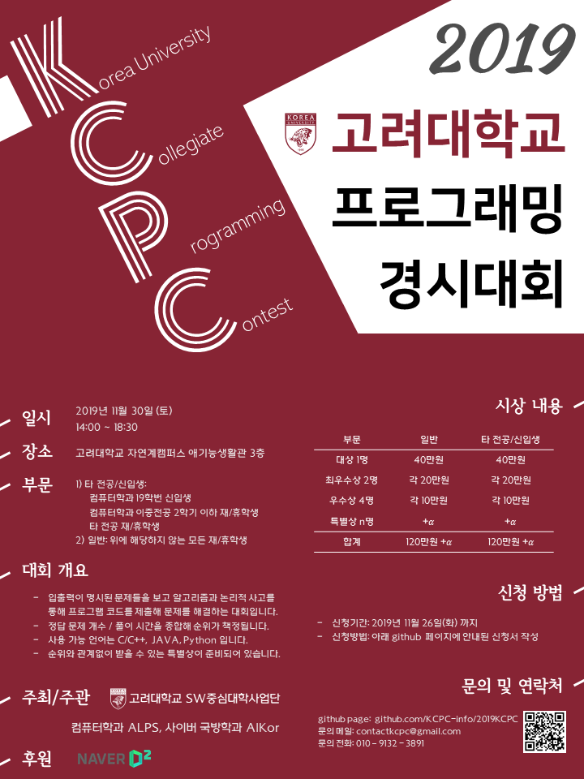

# 2019 고려대학교 프로그래밍 경시대회

대회에 관한 자세한 내용은 <a href=https://github.com/KCPC-info/2019KCPC/blob/master/README.md#%EB%8C%80%ED%9A%8C-%EA%B0%9C%EC%9A%94>아래 README 전체</a>를 참고해 주세요.

## 신청

신청서 링크: https://forms.gle/8muLzCHd38esWDGb7

아래에 명시되어 있는  <a href=https://github.com/KCPC-info/2019KCPC/blob/master/rules.md>참가 기준</a>을 숙지하시고, 해당하는 부문에 맞춰서 신청해 주시면 됩니다. 타 전공/신입생 부문 신청의 경우 참가 기준에 부합하는지 확인하기 위해 운영진 측에서 추가 서류를 요청할 수 있습니다.

- 타 전공/신입생 부문: 다음 세가지 조건 중 하나를 충족시키는 경우 참가 가능
  - 컴퓨터학과, 사이버국방학과 19학번 재/휴학생
  - 컴퓨터학과 소속 이중전공 (SW벤처융합, 정보보호융합 포함) 2학기 이내 재/휴학생
  - 타 전공 재/휴학생
- 일반 부문: 고려대학교 학부 재학생/휴학생 누구나 참가 가능

## 대회 개요

2019년 고려대학교 프로그래밍 경시대회 (2019 KCPC)가 작년에 이어서 개최됩니다. 

- 입출력이 명시된 문제들을 보고 알고리즘과 논리적 사고를 통해 프로그램 코드를 제출해 문제를 해결하는 대회입니다.
- 정답 문제 개수 / 풀이 시간을 종합해 순위가 책정됩니다.
- 사용 가능 언어는 C/C++, JAVA, Python 입니다.
- 순위와 관계없이 특별상 또한 준비되어 있습니다.

## 일시 및 장소

**2019년 11월 30일 토요일 14:00 ~ 18:30**

**고려대학교 자연계캠퍼스 하나스퀘어**

13:30 - 13:55 참가자 등록 및 대회 안내

14:00 - 17:00 대회 진행 (3시간)

17:00 - 17:30 문제 풀이 진행 및 후원사 소개

17:30 - 18:30 수상자 발표 및 시상

- 대회 진행 시간 동안 여러 다과가 제공됩니다.
- 저녁 식사를 위한 샌드위치가 제공됩니다.

## 시상 내용

총 규모 240만원 + a 상당의 상금이 기다리고 있습니다!

#### 타 전공/신입생 부문

- 대상(1명): 40만원

- 최우수상(2명): 각 20만원

- 우수상(4명): 각 10만원

- 특별상 n명: 시상 기준은 대회날 시상식 때 공개됩니다

#### 일반 부문

- 대상(1명): 40만원

- 최우수상(2명): 각 20만원

- 우수상(4명): 각 10만원

- 특별상 n명: 시상 기준은 대회날 시상식 때 공개됩니다

## 세부 규정

#### 준비물

- 학생증(다른 신분증으로 대체 가능)
- 개인 노트북 + 충전기

필기구, 연습지, 다과 등은 제공합니다. 

#### 금지 행위

- 허용된 레퍼런스 페이지를 제외한 메신저, 인터넷 검색, 대화, 이동식 저장 매체를 통한 문제 풀이를 금합니다.
- 의도적으로 허위 정보를 가지고 <타 전공/신입생 부문>에 신청하는 것을 금합니다.
- 대회 진행과 관계없는 사람이 대회 장소에 출입하는 것을 금합니다.

대회 사용 가능 물품, 레퍼런스 페이지, 참가 자격, 상금 시상 등의 세부적인 내용들은 <a href=https://github.com/KCPC-info/2019KCPC/blob/master/rules.md>다음</a>을 참고하세요

## 문의

contactkcpc@gmail.com

ALPS 이세정 010-9132-3891

AlKor 이동관 010-3041-2890

## FAQ

#### 참가 신청을 한 뒤 신청정보를 수정하고 싶은데 어떻게 하나요?

신청서를 새 내용으로 작성해주시면 가장 마지막에 제출된 내용으로 접수를 진행합니다. 단순히 수정하시려고 하신다면 새로 제출해주시면 될 것 같습니다.

#### 문제 형식은 어떤 식으로 나오나요?

ACM-ICPC, 삼성 SCPC/SW Test, 구글 CodeJam 등과 비슷한 형태로 

입출력 형식과 출력값의 조건을 읽고 명시된 내용에 맞게 표준 입출력을 하는 프로그램의 코드를 제출하는 형태입니다. https://www.acmicpc.net/problem/1000 를 참조하시면 될 것 같습니다.

작년 2018 KCPC를 포함한 기출문제는 https://www.acmicpc.net/category/341 에서 확인하실 수 있습니다.

또한 대회 하루 전부터 대회 시스템에 익숙해지실 수 있도록 예비소집을 운영할 예정입니다. 참가자 분들께서는 테스트 계정으로 들어오셔서 문제 형식, 문제 제출, 채점 등을 체험해보실 수 있습니다.